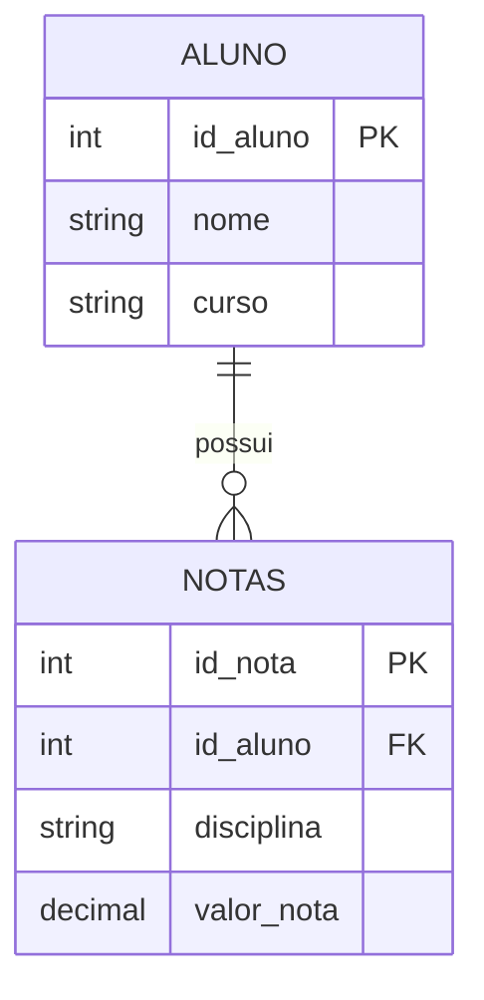

# Introducao

Este trabalho apresenta uma visao introdutoria sobre **Arquitetura de Dados no modelo Lakehouse**, utilizando um sistema academico simples como referencia. O cenario simula o cadastro de alunos e o registro de notas, permitindo explicar conceitos de armazenamento, processamento e confiabilidade de dados em um contexto proximo da realidade.

O objetivo e demonstrar como o uso de tecnologias modernas viabiliza consultas consistentes, historico de versoes e operacoes transacionais em um Data Lake.

## Modelo de dados (1:N)
O relacionamento entre **ALUNO** e **NOTAS** e do tipo **um para muitos**, pois um aluno pode ter varias notas ao longo do curso.

